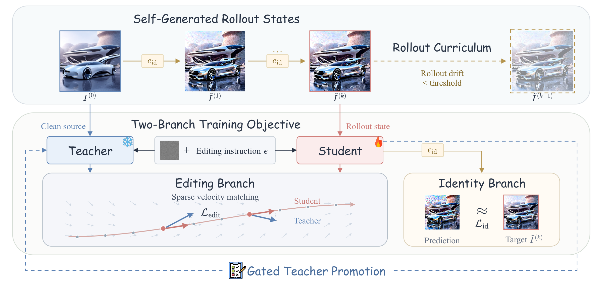

<div align="center" style="font-family: charter;">
<h1><i>MT-OPSD:</i></br>On-Policy Self-Distillation for Multi-Turn Image Editing</h1>


<p align="center">
  
  <a href="https://liangbingzhao.github.io/MT-OPSD/"></a>
  <a href="https://huggingface.co/metazlb/MT-OPSD"></a>
  <a href="https://huggingface.co/datasets/metazlb/LME-Bench"></a>
  <a href="LICENSE"></a>
</p>


<div>
    <a href="https://liangbingzhao.github.io/" target="_blank">Liangbing Zhao</a><sup>1</sup>, </span>
    <a href="https://le-zhuo.com/" target="_blank">Le Zhuo</a><sup>2</sup>, </span>
    <a href="https://cemse.kaust.edu.sa/profiles/mohamed-elhoseiny" target="_blank">Mohamed Elhoseiny</a><sup>1</sup></span>
</div>


<div>
    <sup>1</sup>KAUST&emsp;
    <sup>2</sup>Krea AI&emsp;
</div>



<p align="justify" style="font-size: 0.95em; max-width: 100%; margin: 0.4em auto 0;">
<b>Train on the states you will actually see.</b>
Editing models are trained on clean images, but in multi-turn use they must edit their own imperfect outputs, and they collapse after a few turns.
MT-OPSD rolls the student out on itself with an identity instruction to build <b>self-generated rollout states</b>.
On each state, the <b>editing branch</b> matches the student's velocity to a frozen teacher that sees the clean source, and the <b>identity branch</b> uses the state as its own target.
A <b>rollout curriculum</b> deepens the rollouts as they stay clean, and <b>gated teacher promotion</b> lets improved checkpoints become the teacher.
No multi-turn annotations, no ground-truth edits and no stronger teacher are needed.
</p>


</div>

## 🔥 News

- **[2026/9/29]** — Release the training and inference code, checkpoints for Qwen-Image-Edit-2511, FireRed-Image-Edit-1.0 and FLUX.2 [klein] base 9B, and LME-Bench.

## ✨ Quick Start

### Installation

```bash
git clone https://github.com/liangbingzhao/MT-OPSD.git
cd MT-OPSD

conda create -n mtopsd python=3.10 -y
conda activate mtopsd
pip install -r requirements.txt
```

`requirements.txt` pins the diffusers commit the code was developed on.

---

## 🚀 Model & Data Download

### Our checkpoints and benchmark

| Name | Description | Link |
| --- | --- | --- |
| MT-OPSD | LoRA checkpoints for Qwen-Image-Edit-2511, FireRed-Image-Edit-1.0 and FLUX.2 [klein] base 9B | [HuggingFace](https://huggingface.co/metazlb/MT-OPSD) |
| LME-Bench | 100 ten-turn editing sessions for long-horizon evaluation | [HuggingFace](https://huggingface.co/datasets/metazlb/LME-Bench) |

```bash
# checkpoints (subfolders qwen-image-edit-2511 / firered-image-edit-1.0 / flux2-klein-base-9b)
hf download metazlb/MT-OPSD --local-dir checkpoints
# LME-Bench
hf download metazlb/LME-Bench --repo-type dataset --local-dir benchmark/data
```

### Base models

[Qwen-Image-Edit-2511](https://huggingface.co/Qwen/Qwen-Image-Edit-2511),
[FireRed-Image-Edit-1.0](https://huggingface.co/FireRedTeam/FireRed-Image-Edit-1.0) and
[FLUX.2-klein-base-9B](https://huggingface.co/black-forest-labs/FLUX.2-klein-base-9B) are
loaded from the Hub by default. To use a local copy, pass `--pretrained_path` (or set
`pretrained_path` in the config).

### Training data

Training only reads source images and instructions from
[OmniEdit-Filtered-1.2M](https://huggingface.co/datasets/TIGER-Lab/OmniEdit-Filtered-1.2M);
the edited target images are never used.

```bash
hf download TIGER-Lab/OmniEdit-Filtered-1.2M --repo-type dataset --local-dir /path/to/OmniEdit-Filtered-1.2M
```

## ⚡ Inference

```bash
python inference.py \
    --ckpt checkpoints/qwen-image-edit-2511 \
    --image input.png \
    --output_dir outputs/demo \
    --instructions "Make it a snowy winter scene." "Add a red scarf to the dog." "Convert to a pencil sketch."
```

Each turn edits the previous output; the script writes `turn1.png ... turnN.png` and
`strip.png`. Instructions can also come from a file (`--instructions_file`, one per line), and
`--model qwen-image-edit-2511` without `--ckpt` runs the base model for comparison.

The sampling settings are read from the checkpoint's `adapter_config.json` (512×512 working
area, 30 steps, true CFG 4.0), matching training. The LoRA stays in fp32 under bf16 autocast,
as in training; casting it to bf16 measurably weakens long-horizon robustness.

## 🤖 Training

We provide one config per backbone in `configs/` (`qwen_image_edit_2511.yaml`,
`firered_image_edit_1.0.yaml`, `flux2_klein_base_9b.yaml`). Set `data_root` in the config (or pass it on the command line) and launch on one node. The
released checkpoints were trained on 4 GPUs (80 GB) for 2,000 samples.

```bash
# Default: 4 GPUs
bash scripts/train.sh configs/firered_image_edit_1.0.yaml

# Override: 8 GPUs, and any config key from the command line
NUM_GPUS=8 bash scripts/train.sh configs/qwen_image_edit_2511.yaml --data_root /path/to/OmniEdit-Filtered-1.2M --output_dir outputs/qwen
```

- `max_steps`, `save_every` and checkpoint names count **global samples**, so the number of
  GPUs changes the effective batch size and the number of optimizer steps.
- Re-running the same command **resumes** from the newest checkpoint; `SIGTERM` (preemption,
  time limit) writes a checkpoint before exiting.
- Add `--wandb` for Weights & Biases logging. Every `eval_every` samples, rank 0 runs two
  monitors and saves them to `<output_dir>/eval/`: the identity instruction applied ten times to
  `assets/drift_eval_input.png` (per-round drift from the source), and an eight-turn sentinel
  session in `assets/mt_sentinels/` edited with and without Emu Edit thresholding (per-turn
  difference between the two chains, and colorfulness, which spikes when the images collapse
  into color noise). Neither affects training.

### Gated teacher promotion

All three configs set `gate_promote: true`. Run the gate worker as a second job next to
training (it needs an OpenAI API key for the GPT-4o judge):

```bash
export OPENAI_API_KEY=...
NUM_GPUS=2 bash scripts/gate_worker.sh outputs/qwen_image_edit_2511
```

The worker scores the base model and then the newest checkpoints on the 23 ten-turn
sessions in `assets/gate_set/`. A checkpoint that beats the current teacher on success or
collapse rate is promoted (thresholds `gate_sr_bar` / `gate_col_unlock`, first judged step
`gate_min_step` in the config), and training swaps its frozen teacher at the next poll. The judge
only selects checkpoints and never enters the loss. One gate evaluation takes about 25
minutes on two H100s. Without the worker, the base model stays the teacher.

### Adding a new backbone

The training loop, gate and inference code only use the `EditModel` interface in
`mtopsd/models/base.py`. To support another diffusers editing pipeline:

1. Add `mtopsd/models/<name>.py` with a subclass of `EditModel` implementing
   - `_load_pipeline(path)`: load the pipeline in bf16 on `self.device`;
   - `set_resolution(area)`: set the working pixel area (aspect preserved);
   - `generate(prompt, image, steps, cfg, seed, autocast=None)`: one edit, returns a PIL image;
   - `identity_loss(image, prompt, args)`: single-step flow-matching loss with the image as
     both condition and target, forwarding through `self.ddp_transformer` when it is set;
   - `_opd_setup(instruction, clean_image, drifted_image, num_steps, cfg)`: the student
     (drifted) and teacher (clean) conditionings, a CFG velocity function
     `cfg_v(latents, t, cond)` that keeps a graph only through the conditional branch, and the
     sampler's timesteps and sigmas.

   `qwen_edit.py` and `flux2_klein.py` are complete examples. The shared sparse
   velocity-matching loop in `EditModel.compute_opd_loss` then works unchanged; a backbone
   whose sampler does not fit it can override `compute_opd_loss`.
2. Register it in `MODELS` in `mtopsd/models/__init__.py`.
3. Copy a config, set `model:` and `target_modules`, and calibrate `turns_curriculum_drift` on
   the base model's identity drift (printed by the in-training eval at step 0).

## 📊 LME-Bench

Existing multi-turn benchmarks stop at five turns. **LME-Bench** has 100 ten-turn sessions
mixing local and global edits, scored by a GPT-4o judge with **success rate (SR)** and
**collapse rate (CR)** at every turn.

```bash
python benchmark/sample.py --ckpt checkpoints/qwen-image-edit-2511 --out outputs/lme/mtopsd_qwen
python benchmark/evaluate.py --samples outputs/lme/mtopsd_qwen
```

| Model | SR@5 | SR@10 | CR@5 | CR@10 |
| --- | --- | --- | --- | --- |
| Qwen-Image-Edit-2511 | 0.43 | 0.03 | 0.10 | 0.55 |
| + MT-OPSD | **0.91** | **0.44** | **0.01** | **0.02** |
| FireRed-Image-Edit-1.0 | 0.57 | 0.15 | 0.16 | 0.61 |
| + MT-OPSD | **0.88** | **0.52** | **0.00** | **0.03** |
| FLUX.2 [klein] base 9B | 0.52 | 0.12 | 0.01 | 0.25 |
| + MT-OPSD | **0.76** | **0.38** | **0.00** | **0.04** |

See [`benchmark/README.md`](benchmark/README.md) for the protocol, metric definitions, how to
evaluate other editors, and the full results.

## 📁 Repository Structure

```
train.py                 training entry point
inference.py             multi-turn editing
gate_worker.py           gated teacher promotion worker
configs/                 one recipe per backbone
mtopsd/
  trainer.py             self-rollout, rollout curriculum, both branches, checkpoints
  models/                backbone wrappers (base.py holds the shared velocity matching)
  data.py                OmniEdit reader
  judge.py               GPT-4o multi-turn judge (gate and LME-Bench)
  gate/                  gate evaluation
benchmark/               LME-Bench sampling and evaluation
assets/gate_set/         gate sessions
scripts/                 launch and export helpers
```

## 🤝 Acknowledgement

This codebase builds on [diffusers](https://github.com/huggingface/diffusers) and
[PEFT](https://github.com/huggingface/peft), and trains on
[OmniEdit](https://huggingface.co/datasets/TIGER-Lab/OmniEdit-Filtered-1.2M). We thank
[Qwen-Image](https://github.com/QwenLM/Qwen-Image),
[FireRed-Image-Edit](https://huggingface.co/FireRedTeam/FireRed-Image-Edit-1.0) and
[FLUX.2](https://github.com/black-forest-labs/flux2) for their open models.

## ✏️ Citation

If you find this work useful for your research and applications, please cite using this BibTeX:

```bibtex
@article{zhao2026mtopsd,
  title={MT-OPSD: On-Policy Self-Distillation for Multi-Turn Image Editing},
  author={Zhao, Liangbing and Zhuo, Le and Elhoseiny, Mohamed},
  year={2026}
}
```
